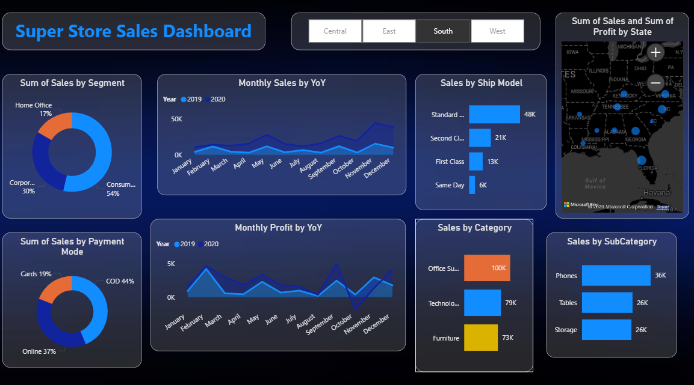

# Interactive Sales Analytics Dashboard

## Project Overview
Developed an interactive Power BI dashboard for analyzing online sales
performance and business insights using data analytics techniques.

## Features
- Interactive dashboard
- KPI tracking
- Drill-down analysis
- Dynamic filters and slicers
- Multiple visualizations
- User-driven reporting

## Tools Used
- Power BI
- Excel
- Data Analytics
- Time Series Analysis

## Dashboard Visualizations
- Bar Chart
- Pie Chart
- Line Chart
- Area Chart
- Maps
- Slicers
- KPI Cards

## Project Screenshot
